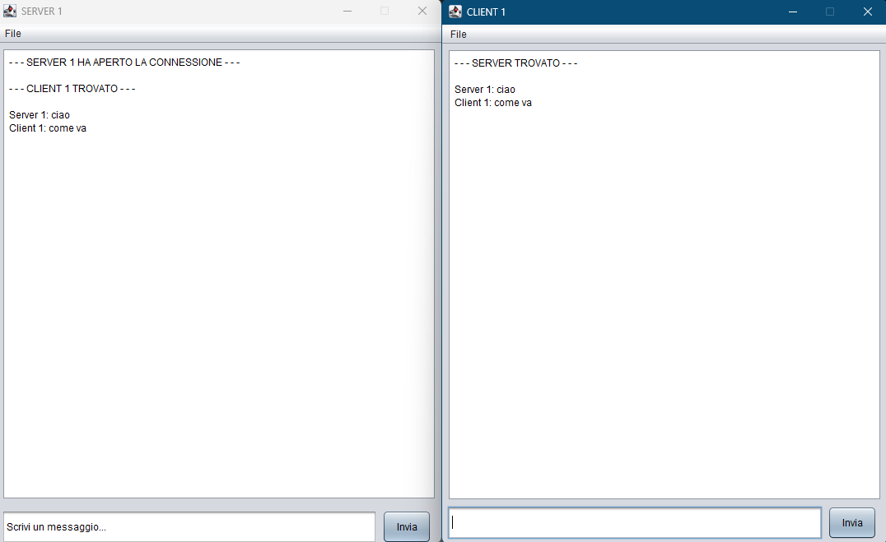
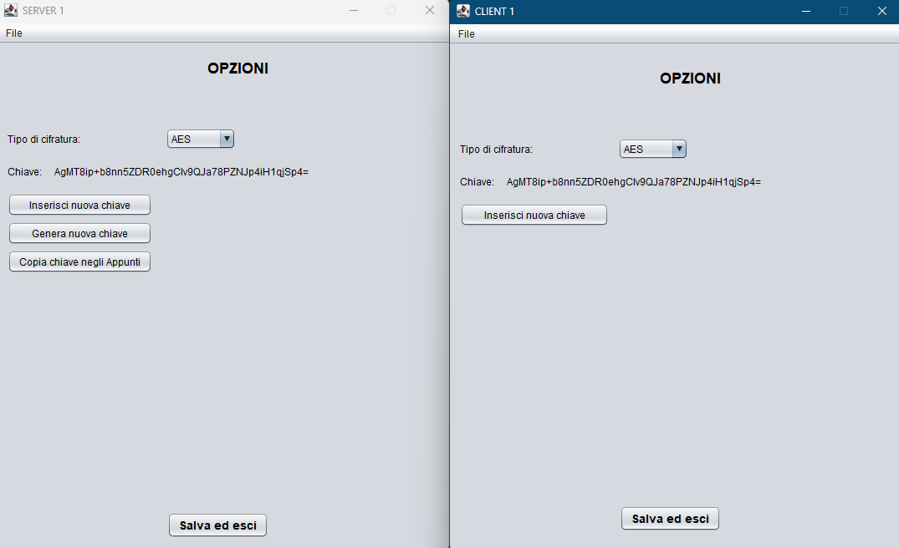

# Encrypted Messenger App
A simple Java-based chat application that enables secure communication between a Server and a Client using various encryption algorithms: **AES**, **DES**, and **Triple DES (3DES)**. The application features a graphical user interface (GUI) for ease of use.

## Table of Contents
- [Encrypted Messenger App](#encrypted-messenger-app)
  - [Features](#features)
  - [How It Works](#how-it-works)
    - [ServerGUI](#servergui)
    - [ClientGUI](#clientgui)
  - [Encryption Algorithms](#encryption-algorithms)
    - [AES (Advanced Encryption Standard)](#aes-advanced-encryption-standard)
    - [DES (Data Encryption Standard)](#des-data-encryption-standard)
    - [3DES (Triple Data Encryption Standard)](#3des-triple-data-encryption-standard)
  - [Getting Started](#getting-started)
    - [Prerequisites](#prerequisites)
    - [Setup](#setup)
    - [Running the Application](#running-the-application)
  - [Configuration](#configuration)
  - [Usage](#usage)
    - [Select Encryption Algorithm](#select-encryption-algorithm)
    - [Key Management](#key-management)
    - [Save Settings](#save-settings)
    - [Start Chatting](#start-chatting)
  - [Important Security Notes](#important-security-notes)
  - [Screenshot](#screenshot)

## Features
- **Secure Communication**: Messages are encrypted with industry-standard algorithms.
- **Multiple Encryption Algorithms**: Choose between AES, DES, and 3DES.
- **Key Management**: Generate new encryption keys or input existing ones manually.
- **Clipboard Integration**: Copy generated keys to your clipboard for easy sharing.
- **User-Friendly GUI**: Clean and simple interface for sending and receiving messages.

## How It Works
The application consists of two main components:

- **ServerGUI**: Listens for incoming client connections. Handles incoming/outgoing message encryption and decryption and manages the encryption key.
- **ClientGUI**: Connects to the server, handles message sending and receiving, and manages its own encryption parameters.

Communication is established via **TCP sockets**. All messages are encrypted before transmission and decrypted upon reception based on the selected algorithm.

## Encryption Algorithms

### AES (Advanced Encryption Standard)
- Uses a **256-bit key**.
- Implemented with **GCM (Galois/Counter Mode)** for authenticated encryption.
- Each message uses a **unique IV** (Initialization Vector) generated randomly and transmitted with the ciphertext.

### DES (Data Encryption Standard)
- Symmetric-key algorithm using a **56-bit key**.
- **Not recommended** for modern applications due to weak security.

### 3DES (Triple Data Encryption Standard)
- Applies DES three times using **112-bit key** (two-key version).
- More secure than DES but **slower than AES**.

## Getting Started

### Prerequisites
- Java Development Kit (JDK) 8 or higher.
- IDE such as **NetBeans**, **IntelliJ IDEA**, or **Eclipse**.
  > _NetBeans was likely used for GUI design._

### Setup
1. Clone the repository or download the source code.
2. Open the project in your IDE.
3. Compile the following files:
   - `methods.java`
   - `ServerGUI.java`
   - `ClientGUI.java`

### Running the Application

- **Start the Server**: Run `ServerGUI.java`. It listens on port **3333**.
- **Start the Client**: Run `ClientGUI.java`. It attempts to connect to the server.

## Configuration
- On the same LAN, the client should connect to the server's local IP (e.g., `192.168.1.X`).

## Usage

1. **Select Encryption Algorithm**:
   - In the Server and Client GUIs, go to `File > Options...`.
   - Choose between: `None`, `DES`, `3DES`, `AES`.

2. **Key Management**:
   - Click `Generate Key` to create a new key.
   - Or manually enter a key in the field.
   - Use `Copy Key to Clipboard` to share it with the other party.

   > ⚠️ For symmetric encryption, both sides must use the **same key**.

3. **Save Settings**:
   - Click `Save and Exit` to confirm your settings.

4. **Start Chatting**:
   - Enter a message in the text field and press `Send`.
   - Messages are encrypted and decrypted automatically.

## Important Security Notes

- **Key Sharing**: Symmetric keys must be securely exchanged **outside** the app.
- **DES Warning**: DES is outdated and **insecure**. Prefer AES for strong encryption.
- **AES IV Usage**: A unique IV is generated per message in GCM mode—**never reuse** an IV with the same key.
- **Exception Handling**: Basic handling is included, but production use requires more robust logging and error management.

## Screenshot

